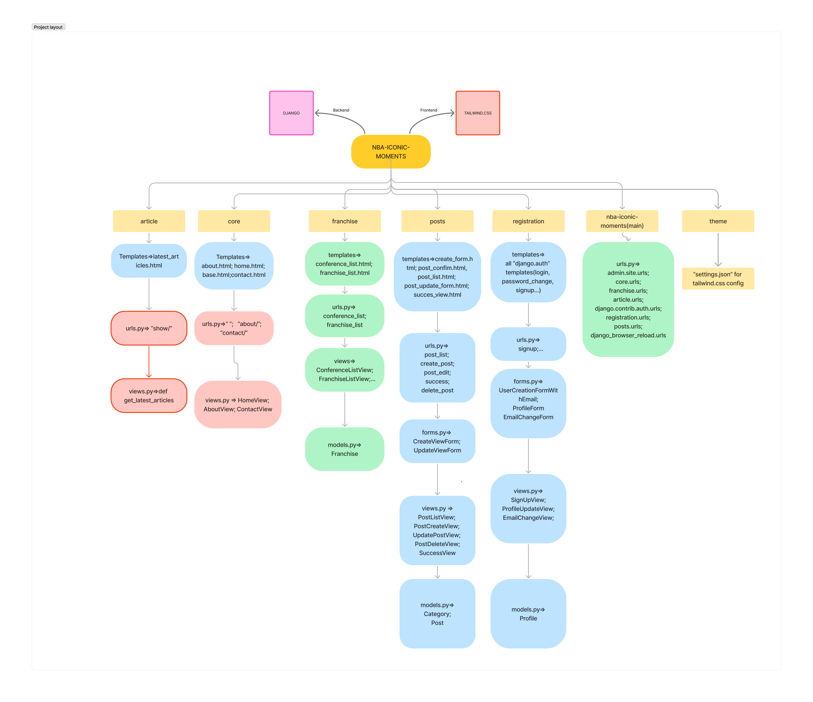
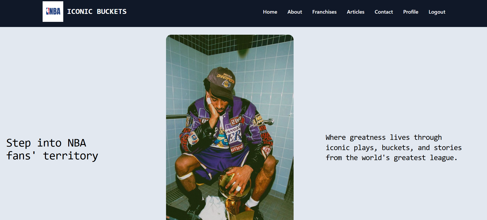
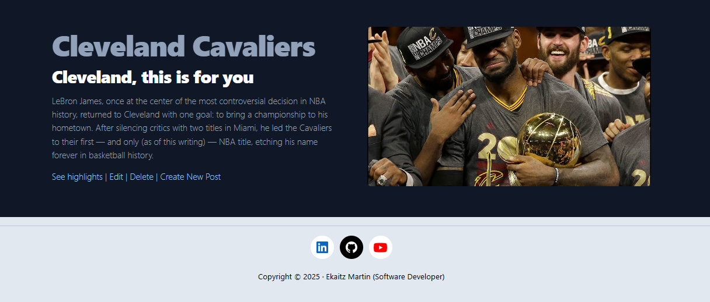
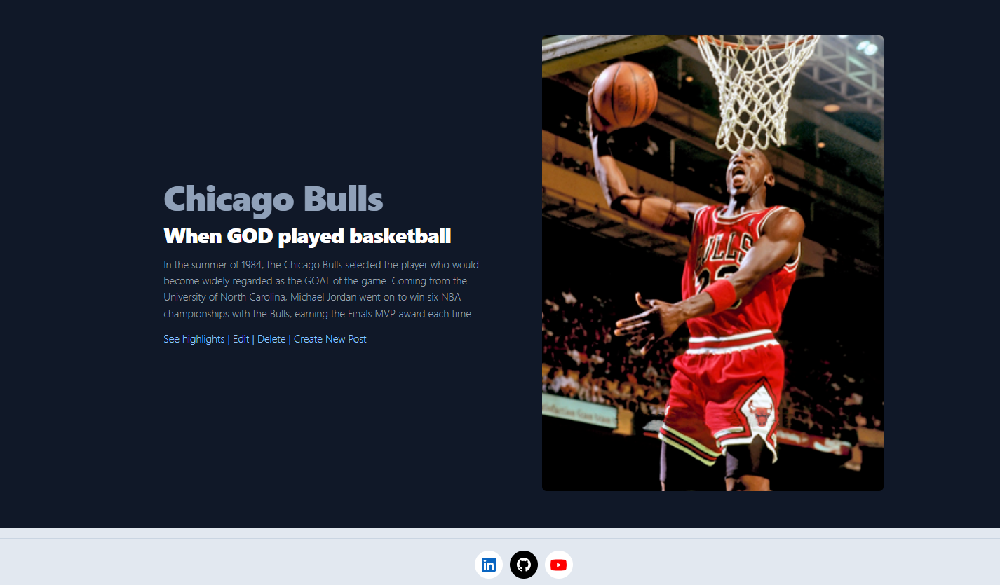
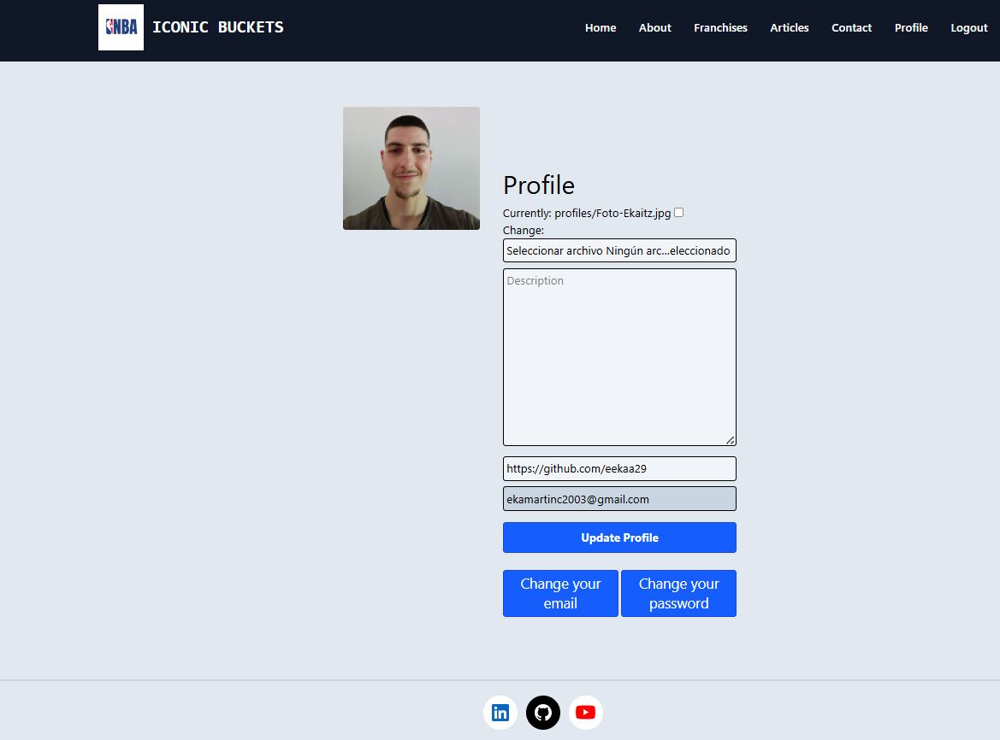

**English**

# 🏀 NBA Iconic Project

The main idea of this project is to gather the most iconic and memorable moments in NBA history. Each story, moment, or event is presented in a specific post, organized by franchise and by the conference to which each franchise belongs (for now, posts are only available for the Lakers, Bulls, Warriors, Spurs, and Cavaliers franchises. More will be added over time). 

Additionally, the website includes an integrated API in the **Articles** section that allows users to consult the most recent NBA news published by the major U.S. sports media outlets (Slam, ESPN, Bleacher Report, NBA.com, and Yahoo).

## 🛠️ Technologies Used

### Backend

The main goal of this project is to practice using the Django framework, so the entire backend is built with Django.

### Frontend

For the frontend, I used django-tailwind.css and JavaScript.  
The **theme** app contains the **settings.json** file, which is the script where you must add the templates that include Tailwind classes.

## ⚙️ Features

- Posts about unforgettable NBA moments (currently limited to a few franchises, but more will be added in the future).
- CRUD operations for posts (available to staff members).
- API integration to fetch the latest NBA news (from ESPN, Slam, Yahoo, and Bleacher Report).
- Filter news by team.
- Sign Up
- Login
- Logout
- Change password
- Change email
- Profile page for each user

## 🧱 Project Structure

<a href="https://www.figma.com/board/jUAhvCF0w0WnV1mw0e0Hov/NBA-ICONIC-MOMENTS?node-id=0-1&p=f&t=Wyyn0qayPLG2lCwp-0">Link to Figma</a>

## 🎨 Project Design

### Home

### Franchises

### Posts

### Profile

## 🚀 How to Run the Project

- Clone the repository:
  - **https://github.com/eekaa29/nba-iconic-moments.git**

- Install requirements inside a virtual environment:
  - `pip install -r requirements.txt`

## 👤 Author

Ekaitz Martin – Practice project built with Django and Tailwind.css

**Español**

# 🏀 NBA Iconic Project

La idea principal del proyecto es reunir los momentos más icónicos y memorables de la historia de la NBA. Cada historia, momento o suceso consiste en un post específico, ordenados por franquicia y por la conferencia en la que cada franquicia se encuentra(Por el momento sólo hay posts sobre las franquicias de Lakers, Bulls, Warriors, Spurs y Cavaliers. Con el tiempo habrá más). Además, la web tiene una API integrada en la seccion **Articles** la cual permite consultar las noticias más recientes del mundo NBA publicadas por los medios más grandes de EEUU(Slam, ESPN, Bleacher Report, NBA.com y Yahoo) 

## Tecnologías utilizadas

### Backend

El objetico de este proyecto es prácticar con el framework Django, por lo que el backend al completo está creado sobre esta herramienta.

### Frontend

Para el fontend he usado django-tailwind.css y JavaScript.
En la app **theme** se encuentra **settings.json**, el script donde hay que añadir los templates que contengan clases de tailwind

## ⚙️ Funcionalidades

- Posts de momentos que se recordarám siempre en la NBA(solo de unas pocas franquicias, en el futuro se irán añadiendo más).
- Operaciones CRUD para los posts (para usuarios que sean parte del staff)
- Integración de una API para colsultar las noticias más recientes publicadas por los periódicos(ESPN, Slam, Yahoo y Bleacher Report)
- Filtar las noticias por equipo 
- SignUp
- Login
- Logout
- Cambio de contraseña
- Cambio de email
- Perfil para cada usuario

## 🧱 Estructura del Proyecto

<a href="https://www.figma.com/board/jUAhvCF0w0WnV1mw0e0Hov/NBA-ICONIC-MOMENTS?node-id=0-1&p=f&t=Wyyn0qayPLG2lCwp-0">Enlace al figma<a>

## Estética del Proyecto

### Home

### Franchises

### Posts

### Profile

## ¿Cómo ejecutar el proyecto?

- Clonar el repo
    - **https://github.com/eekaa29/nba-iconic-moments.git**

- Intalar requirements.txt dentro de un entorno virtual
    -  pip install -r requirements.txt

## Autor 

Ekaitz Martin - Proyecto de práctica para Django y Tailwind.css